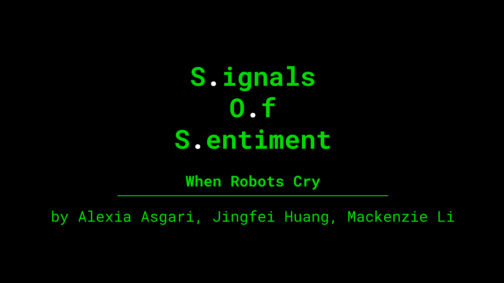

# UselessMachine

)

Materials:
Arduino Uno, moter shield, water pump, board, LCD+I2C, force sensor, speaker, LEDs

UselessCryBaby.ino is the main file that controls the 'emotion' of the robot according to the human interaction.
animatedFace.ino is the file that controls the facial expression (animation) of the robot.
